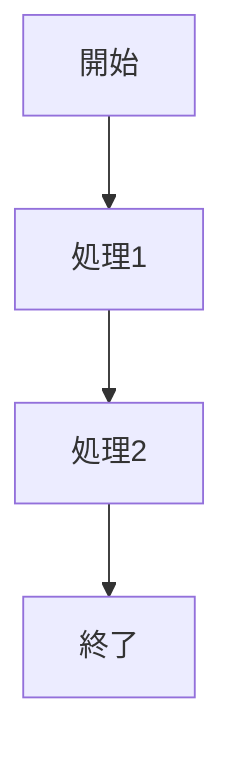
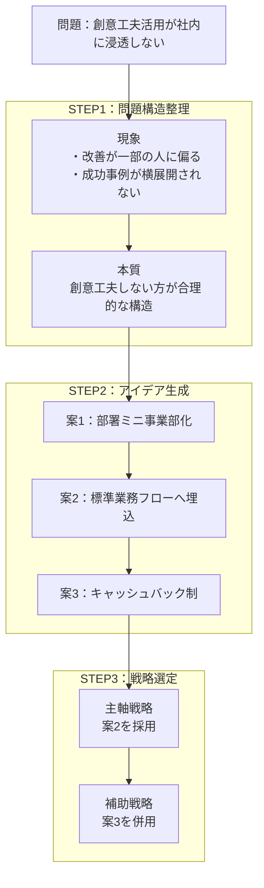
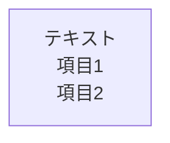
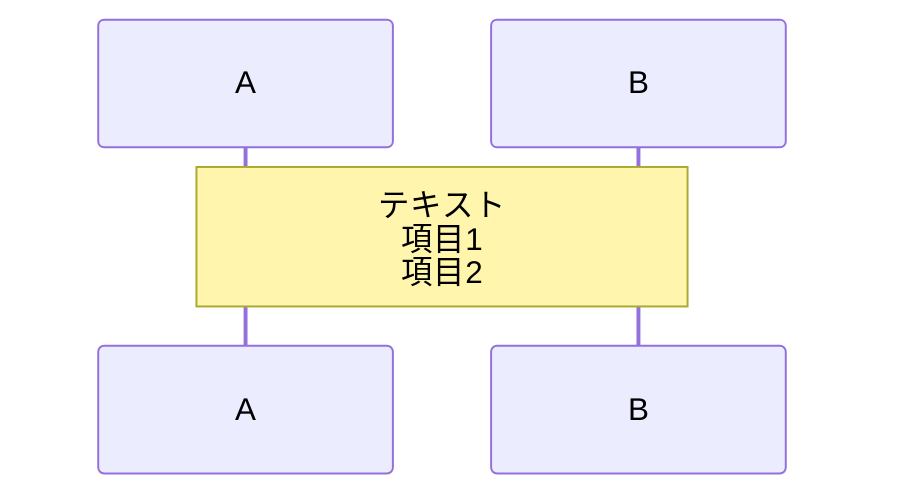
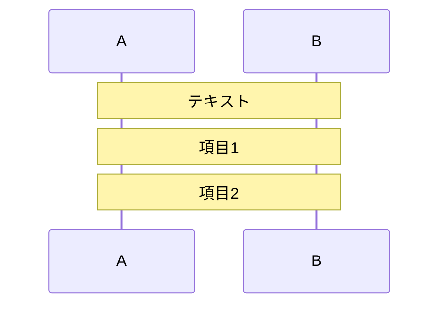

# エラーなしで動作する簡単なテストコード

以下のコードをコピーして、エディタに貼り付けてください。このコードは構文エラーなく動作します。

## シンプルなフローチャート



## 元のコードの修正版（簡略版）



## iPhoneでのダウンロード手順

### 方法1: 共有シートを使用（推奨）

1. 「PNG保存」または「SVG保存」ボタンをタップ
2. 共有シートが表示されます
3. **「ファイルに保存」**を選択
4. 保存先を選択（iCloud Drive、このiPhone内など）
5. 「保存」をタップ

### 方法2: 共有できない場合

1. 「PNG保存」ボタンをタップ
2. Safariの「ダウンロード」アイコン（↓）をタップ
3. ダウンロードしたファイルを確認
4. ファイルを長押しして「共有」→「画像を保存」（PNG の場合）

### 方法3: スクリーンショット（最終手段）

1. プレビュー画面で図を表示
2. iPhoneのスクリーンショット機能を使用
   - iPhone X以降: 音量上ボタン + サイドボタン
   - iPhone 8以前: ホームボタン + 電源ボタン
3. 写真アプリで編集して必要な部分をトリミング

## 自動変換機能

このエディタは以下の自動変換を行います：

### 1. フローチャート等での`<br/>`タグ変換

**入力:**


**自動変換後:**


### 2. シーケンス図のNote内`<br/>`タグ分割

**入力:**


**自動変換後:**


### ✅ 結果

- **`<br/>`タグを含むコードをそのまま貼り付けてもOK**
- 自動的に正しい形式に変換されます
- エディタのコードも自動更新されます

## トラブルシューティング

### "Syntax error in text" が出る場合

以下を確認してください：

1. **存在しないノードIDへの参照**
   ```
   ❌ 悪い例: S4 --> S5継続  （S5継続は存在しない）
   ✅ 良い例: S4_1 --> S5_1  （定義済みのノード）
   ```

2. **改行の位置**
   - `<br/>`タグは自動変換されるので、そのまま使用してOK
   - または最初から改行を使用してください

3. **特殊文字**
   - 日本語の全角記号は問題ありません
   - ただし、引用符（"）はエスケープが必要な場合があります

### iPhoneでダウンロードできない場合

1. **Safari を使用していますか？**
   - Chrome や他のブラウザではWeb Share APIが動作しない場合があります
   - Safariを使用してください

2. **iOSバージョンを確認**
   - iOS 13.4以降が必要です
   - 設定 → 一般 → 情報 で確認できます

3. **ブラウザの設定を確認**
   - Safari → 設定 → ダウンロード
   - 「ダウンロード先」を確認

4. **それでも動作しない場合**
   - ページを再読み込み（更新）してください
   - Safariを完全に閉じて、再度開いてください
   - iPhoneを再起動してください

## 正しく動作する完全版コード

example-fixed.md を参照してください。
