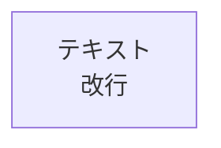

# Mermaid図エディタ

高品質なPNGとSVGエクスポートが可能な、日本語対応Mermaid図エディタです。

## 🚀 クイックスタート

**エラーが出ていますか？** → [QUICK-START.md](QUICK-START.md) を参照してください

- ✅ エラーなしで動作するテストコード
- ✅ iPhoneでのダウンロード手順（詳細）
- ✅ トラブルシューティングガイド

## 特徴

- 🎨 **リアルタイムプレビュー**: コード入力時に自動的に図を更新
- 📸 **16倍超高解像度PNG**: 文字が非常に鮮明なPNG画像を生成
- 📄 **エラーなしSVG**: 完全にクリーンなSVGファイルを出力
- 📱 **スマホ完全対応**: iPhone/AndroidでWeb Share APIを使用して簡単に共有・保存
- 🔄 **自動変換**: `<br/>`タグを自動的に改行に変換
- 🌐 **日本語フォント最適化**: 日本語テキストの表示を最適化
- 💾 **自動保存**: LocalStorageにコードを自動保存

## 使い方

### 基本操作

1. `index.html`をブラウザで開く
2. 左側のエディタにMermaidコードを入力
3. 右側のプレビューで図を確認
4. 「PNG保存」または「SVG保存」ボタンでエクスポート

### ショートカット

- `Ctrl+Enter` (Mac: `Cmd+Enter`): 図を実行
- `Tab`: インデント挿入

### スマホでの使い方

#### 📱 iPhone / Androidでの保存・共有

1. `index.html`をスマホのブラウザで開く
2. Mermaidコードを入力または編集
3. 「PNG保存」または「SVG保存」ボタンをタップ
4. **共有シートが表示されます**（iOS/Android対応）
5. 保存先を選択：
   - 📁 ファイルアプリに保存
   - 📷 写真アプリに保存（PNG）
   - ✉️ メールで送信
   - 💬 LINEやSNSで共有
   - ☁️ クラウドストレージに保存

#### 💡 ヒント

- **iOS Safari**: 共有シートから「ファイルに保存」を選択してiCloud DriveやDropboxに保存できます
- **Android Chrome**: 共有メニューから「ダウンロード」または「ドライブに保存」を選択できます
- **共有がキャンセルされた場合**: 自動的に通常のダウンロードにフォールバックします

### 重要な注意事項

#### ❌ 使用しないでください


#### ✅ 正しい書き方


**理由**: `<br/>`タグを使用すると、SVG保存時にXMLエラーが発生します。エディタは自動的に改行に変換しますが、最初から改行を使用することをお勧めします。

## 修正済みコード例

`example-fixed.md`に、元のコードを修正したバージョンが含まれています。以下の問題を修正しました：

1. **SVGエラー修正**: `htmlLabels: false`に設定し、HTMLタグを使用しない
2. **構文エラー修正**: 存在しないノードIDへの参照を修正
3. **PNG品質向上**: 16倍解像度で超鮮明な画像を生成

## エクスポート品質

### PNG（推奨）
- **解像度**: 16倍（4000px以上の図も鮮明）
- **品質**: imageSmoothingQuality = 'high'
- **用途**: プレゼンテーション、ドキュメント、印刷

### SVG
- **エラーなし**: HTMLタグを完全に削除
- **互換性**: すべてのSVGビューアで正しく表示
- **用途**: Webページ、編集可能な図、無限ズーム

## テンプレート

エディタには以下のテンプレートが含まれています：

- フローチャート
- シーケンス図
- クラス図
- 状態遷移図
- ER図
- ガントチャート
- 円グラフ
- Gitグラフ

## トラブルシューティング

### SVGエラー: "opening and ending tag mismatch"

**原因**: コードに`<br/>`タグが含まれている

**解決策**:
1. エディタで「実行」ボタンをクリック - 自動的に改行に変換されます
2. または、手動で`<br/>`を削除して改行に置き換える

### PNGがぼやけている

**解決策**:
1. エディタで「PNG保存」ボタンを再度クリック（16倍解像度で保存されます）
2. 保存されたPNGファイルを画像ビューアで開く
3. 拡大しても文字が鮮明に表示されるはずです

### 図が表示されない

**確認事項**:
1. インターネット接続を確認（Mermaid CDNが必要）
2. ブラウザのコンソールでエラーを確認
3. コードの構文が正しいか確認

### スマホでダウンロードできない

**解決策**:
1. **Web Share APIを使用**: 「PNG保存」または「SVG保存」をタップすると共有シートが表示されます
2. **共有シートから保存**:
   - iOS: 「ファイルに保存」→保存先を選択
   - Android: 「ダウンロード」または「ドライブに保存」を選択
3. **古いブラウザの場合**: 最新版のSafari（iOS）またはChrome（Android）に更新してください
4. **フォールバック**: 共有がキャンセルされた場合、自動的に通常のダウンロードが試行されます

## 技術仕様

- **Mermaid**: v10.6.1
- **フォントサイズ**: 18px
- **日本語フォント**: Hiragino Sans, Noto Sans JP, Meiryo
- **PNG解像度**: 16倍スケール
- **PNG品質**: 1.0 (最高品質)
- **htmlLabels**: false (SVGエラー防止)
- **モバイル対応**:
  - Web Share API（iOS/Android）
  - 自動デバイス判定
  - iOS Safari最適化
  - フォールバック機能

## ファイル構成

```
Mermaid/
├── index.html          # メインエディタ
├── example-fixed.md    # 修正済みコード例
└── README.md           # このファイル
```

## ライセンス

このプロジェクトはMIT Licenseの下で公開されています。

## サポート

問題や質問がある場合は、GitHubのIssuesで報告してください。
