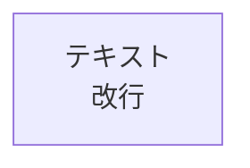

# Mermaid図エディタ

高品質なPNGとSVGエクスポートが可能な、日本語対応Mermaid図エディタです。

## 特徴

- 🎨 **リアルタイムプレビュー**: コード入力時に自動的に図を更新
- 📸 **16倍超高解像度PNG**: 文字が非常に鮮明なPNG画像を生成
- 📄 **エラーなしSVG**: 完全にクリーンなSVGファイルを出力
- 🔄 **自動変換**: `<br/>`タグを自動的に改行に変換
- 🌐 **日本語フォント最適化**: 日本語テキストの表示を最適化
- 💾 **自動保存**: LocalStorageにコードを自動保存

## 使い方

### 基本操作

1. `index.html`をブラウザで開く
2. 左側のエディタにMermaidコードを入力
3. 右側のプレビューで図を確認
4. 「PNG保存」または「SVG保存」ボタンでエクスポート

### ショートカット

- `Ctrl+Enter` (Mac: `Cmd+Enter`): 図を実行
- `Tab`: インデント挿入

### 重要な注意事項

#### ❌ 使用しないでください


#### ✅ 正しい書き方


**理由**: `<br/>`タグを使用すると、SVG保存時にXMLエラーが発生します。エディタは自動的に改行に変換しますが、最初から改行を使用することをお勧めします。

## 修正済みコード例

`example-fixed.md`に、元のコードを修正したバージョンが含まれています。以下の問題を修正しました：

1. **SVGエラー修正**: `htmlLabels: false`に設定し、HTMLタグを使用しない
2. **構文エラー修正**: 存在しないノードIDへの参照を修正
3. **PNG品質向上**: 16倍解像度で超鮮明な画像を生成

## エクスポート品質

### PNG（推奨）
- **解像度**: 16倍（4000px以上の図も鮮明）
- **品質**: imageSmoothingQuality = 'high'
- **用途**: プレゼンテーション、ドキュメント、印刷

### SVG
- **エラーなし**: HTMLタグを完全に削除
- **互換性**: すべてのSVGビューアで正しく表示
- **用途**: Webページ、編集可能な図、無限ズーム

## テンプレート

エディタには以下のテンプレートが含まれています：

- フローチャート
- シーケンス図
- クラス図
- 状態遷移図
- ER図
- ガントチャート
- 円グラフ
- Gitグラフ

## トラブルシューティング

### SVGエラー: "opening and ending tag mismatch"

**原因**: コードに`<br/>`タグが含まれている

**解決策**:
1. エディタで「実行」ボタンをクリック - 自動的に改行に変換されます
2. または、手動で`<br/>`を削除して改行に置き換える

### PNGがぼやけている

**解決策**:
1. エディタで「PNG保存」ボタンを再度クリック（16倍解像度で保存されます）
2. 保存されたPNGファイルを画像ビューアで開く
3. 拡大しても文字が鮮明に表示されるはずです

### 図が表示されない

**確認事項**:
1. インターネット接続を確認（Mermaid CDNが必要）
2. ブラウザのコンソールでエラーを確認
3. コードの構文が正しいか確認

## 技術仕様

- **Mermaid**: v10.6.1
- **フォントサイズ**: 18px
- **日本語フォント**: Hiragino Sans, Noto Sans JP, Meiryo
- **PNG解像度**: 16倍スケール
- **PNG品質**: 1.0 (最高品質)
- **htmlLabels**: false (SVGエラー防止)

## ファイル構成

```
Mermaid/
├── index.html          # メインエディタ
├── example-fixed.md    # 修正済みコード例
└── README.md           # このファイル
```

## ライセンス

このプロジェクトはMIT Licenseの下で公開されています。

## サポート

問題や質問がある場合は、GitHubのIssuesで報告してください。
