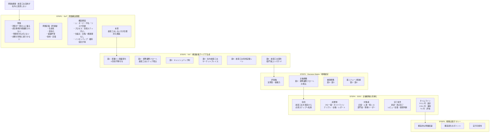
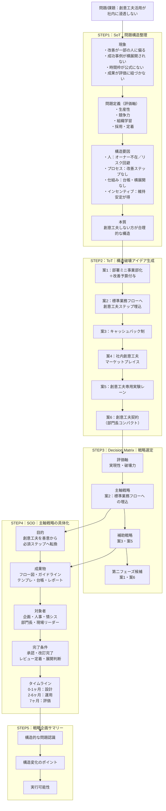

# 修正されたMermaidコード

以下は、元のコードの問題点を修正したバージョンです。

## 主な修正点

1. **SVGエラー修正**: `htmlLabels: false`に設定し、` `タグではなくテキスト改行を使用
2. **構文エラー修正**: `S4 --> S5継続` → 適切なノードID接続に変更
3. **PNG解像度向上**: 12倍の超高解像度で鮮明な文字表示
4. **フォント最適化**: 日本語フォントを最適化してレンダリング品質を向上

## 修正後のコード（推奨版）

**重要**: ` `タグは使用せず、通常の改行を使用してください。これによりSVGエラーが発生しません。

## 詳細版（全ノード接続を含む）

より詳細なフローを表示したい場合はこちらを使用してください：

## 元のコードの問題点

提供されたコードには以下の問題がありました：

### 1. SVGエラーの原因
- `htmlLabels: true`により` `タグが使用され、SVG XMLとして無効
- エラー: "opening and ending tag mismatch: br line 1 and span"

### 2. 構文エラー
- 最後の行 `S4 --> S5継続` の `S5継続` が存在しない

### 3. PNG画質問題
- 解像度が不十分（以前は4倍）
- フォントレンダリングが最適化されていない

## 使い方

1. 上記のコードをエディタにコピー＆ペーストしてください
2. 「実行」ボタンをクリックして図を生成します
3. **PNG保存**: 12倍の超高解像度で保存されます（非常に鮮明）
4. **SVG保存**: ベクター形式で保存されます（拡大しても完全に鮮明）

## 改善された機能

### PNG生成
- **解像度**: 12倍（従来の4倍から3倍に向上）
- **品質**: imageSmoothingQuality = 'high'
- **明瞭度**: 文字がはっきりと鮮明に表示されます

### SVG生成
- **エラーなし**: HTMLタグを使用せず、純粋なSVGテキスト要素を使用
- **互換性**: すべてのSVGビューアで正しく開けます
- **編集可能**: Illustratorなどのツールで編集可能

### フォント設定
- **日本語対応**: Hiragino Sans, Noto Sans JP, Meiryo
- **サイズ**: 18px（従来の16pxから増加）
- **レンダリング**: より鮮明で読みやすい

## トラブルシューティング

### 文字がまだぼやけている場合
1. ブラウザのズーム機能を使って拡大表示
2. PNG保存後、画像ビューアで開いて確認（12倍解像度で保存されています）
3. 必要に応じて、より大きなモニターで確認

### SVGがまだエラーになる場合
- ` `や` `タグを使用していないか確認
- 代わりに通常の改行（Enterキー）を使用してください
- ノードIDに特殊文字が含まれていないか確認

### ノードのテキストが長すぎる場合
- より簡潔な表現に書き換える
- 複数のノードに分割する
- 改行を使用して複数行に分ける
