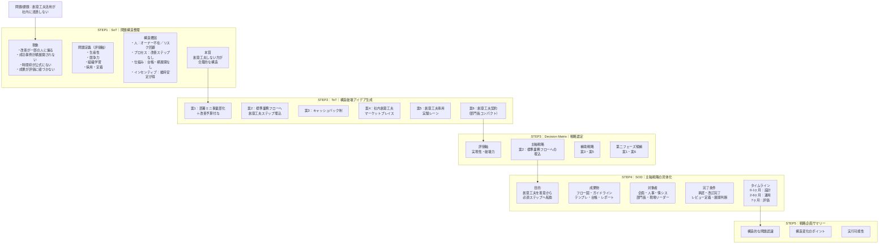

# 修正されたMermaidコード

以下は、元のコードの問題点を修正したバージョンです。

## 主な修正点

1. **構文エラー修正**: `S4 --> S5継続` → `S4_5 --> S5_1`
2. **矢印の接続**: subgraphからsubgraphへの矢印を、具体的なノードID間の接続に変更
3. **読みやすさ向上**: 一部のノードの記述を整理

## 修正後のコード

```mermaid
graph TD

  %% ルート
  ROOT["問題/課題：創意工夫活用が社内に浸透しない"]

  %% STEP1 SoT
  subgraph S1["STEP1：SoT（Structure of Thought）｜問題構造整理"]
    S1_1["現象<br/>・改善が一部の人に偏る<br/>・成功事例が横展開されない<br/>・時間枠が公式にない<br/>・成果が評価に紐づかない"]
    S1_2["問題定義（評価軸）<br/>・生産性<br/>・競争力<br/>・組織学習<br/>・採用・定着"]
    S1_3["構造要因<br/>・人：オーナー不在／リスク回避<br/>・プロセス：改善ステップなし<br/>・仕組み：台帳・横展開なし<br/>・インセンティブ：維持安定が得"]
    S1_4["本質<br/>『創意工夫しない方が合理的』という構造"]
  end

  %% STEP2 ToT
  subgraph S2["STEP2：ToT（Tree of Thoughts）｜構造破壊アイデア生成"]
    S2_1["案1：部署ミニ事業部化＋改善予算付与<br/>（改善を現場の投資に）"]
    S2_2["案2：標準業務フローへ<br/>創意工夫ステップ埋込<br/>（善意→必須ステップへ）"]
    S2_3["案3：キャッシュバック制<br/>（効果の一部を部門予算へ還元）"]
    S2_4["案4：社内創意工夫マーケットプレイス<br/>（課題オーナーと解決者を分離）"]
    S2_5["案5：創意工夫専用実験レーン<br/>（失敗リスクを隔離）"]
    S2_6["案6：創意工夫契約（部門長コンパクト）<br/>（善意→マネジメント責務へ）"]
  end

  %% STEP3 Decision Matrix
  subgraph S3["STEP3：Decision Matrix｜戦略選定"]
    S3_A["評価軸<br/>・実現性（1〜5）<br/>・破壊力（1〜5）"]
    S3_1["主軸戦略<br/>・案2：標準業務フローへの埋込"]
    S3_2["補助戦略<br/>・案3：キャッシュバック制<br/>・案5：実験レーン設置"]
    S3_3["第二フェーズ候補<br/>・案1：ミニ事業部化<br/>・案6：創意工夫契約"]
    S3_4["保留案<br/>・案4：マーケットプレイス"]
  end

  %% STEP4 SOD
  subgraph S4["STEP4：SOD（Statement of Deliverables）｜主軸戦略の具体化"]
    S4_1["目的<br/>創意工夫を『善意』から<br/>『標準業務の必須ステップ』へ転換"]
    S4_2["成果物<br/>・創意工夫サイクル標準フロー図<br/>・ガイドライン<br/>・改訂済標準書テンプレ<br/>・創意工夫台帳／レビュー様式<br/>・パイロット結果レポート"]
    S4_3["対象者<br/>・オーナー：企画／改善推進<br/>・共創：人事・情シス<br/>・実行：各部門長／現場リーダー"]
    S4_4["完了条件（Done）<br/>・標準フロー＆ガイドライン承認<br/>・パイロット部門の標準書改訂完了<br/>・月次レビュー定着＆一定割合が標準化<br/>・経営会議で全社展開可否決定"]
    S4_5["タイムライン<br/>0-1ヶ月：As-Is/To-Be設計<br/>2-3ヶ月：パイロット設計<br/>4-6ヶ月：運用<br/>7ヶ月：評価・判断"]
  end

  %% STEP5 Summary
  subgraph S5["STEP5：戦略企画サマリー（経営向け）"]
    S5_1["構造的な問題認識<br/>・『創意工夫しない方が合理的』な現行構造"]
    S5_2["構造変化のポイント<br/>・業務フローと標準書そのものを<br/>『常に更新される前提』に再設計"]
    S5_3["実行可能性<br/>・まずパイロット部門から開始<br/>・データと実績をもとに全社展開判断"]
  end

  %% 矢印（系統）- 具体的なノード間の接続
  ROOT --> S1_1
  S1_1 --> S1_2
  S1_2 --> S1_3
  S1_3 --> S1_4
  S1_4 --> S2_1
  S2_1 --> S2_2
  S2_2 --> S2_3
  S2_3 --> S2_4
  S2_4 --> S2_5
  S2_5 --> S2_6
  S2_6 --> S3_A
  S3_A --> S3_1
  S3_1 --> S3_2
  S3_2 --> S3_3
  S3_3 --> S3_4
  S3_1 --> S4_1
  S3_2 --> S4_2
  S4_1 --> S4_2
  S4_2 --> S4_3
  S4_3 --> S4_4
  S4_4 --> S4_5
  S4_5 --> S5_1
  S5_1 --> S5_2
  S5_2 --> S5_3
```

## より簡潔なバージョン（推奨）

subgraph間の矢印を整理して、より視覚的に分かりやすくしたバージョンです：

## 使い方

1. 上記のコードをエディタにコピー＆ペーストしてください
2. 「実行」ボタンをクリックして図を生成します
3. PNG保存：高解像度（8倍）で保存されます
4. SVG保存：ベクター形式で保存されます（拡大しても鮮明）

## トラブルシューティング

### 文字が見えにくい場合
- ブラウザのズーム機能を使って拡大してください
- PNG保存時は8倍の解像度で保存されるため、鮮明に表示されます

### SVGエラーが出る場合
- ノードIDに日本語を使用していないか確認してください
- 矢印の接続先が存在するノードIDか確認してください
- subgraph名とノードIDが重複していないか確認してください
