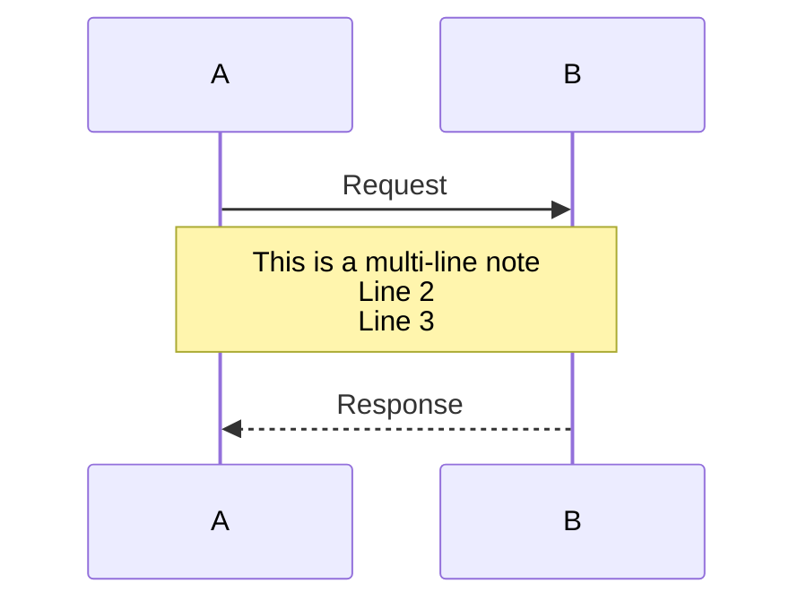
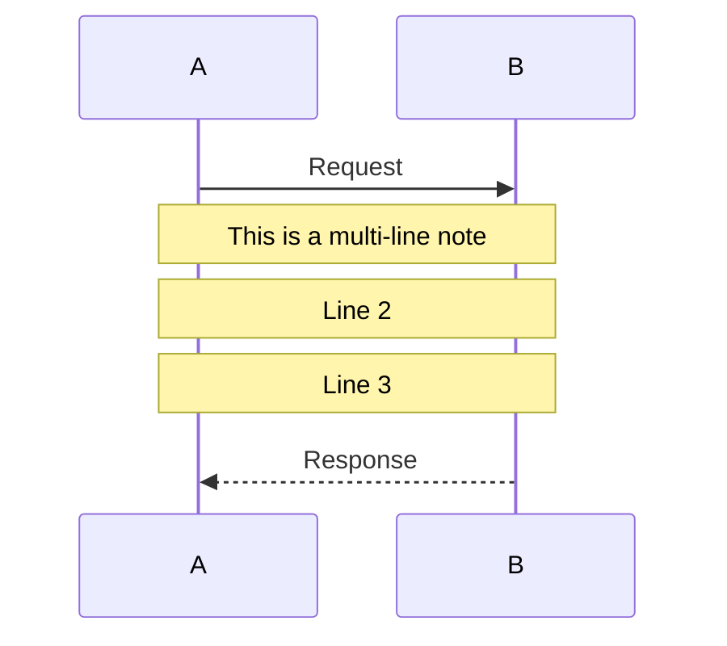
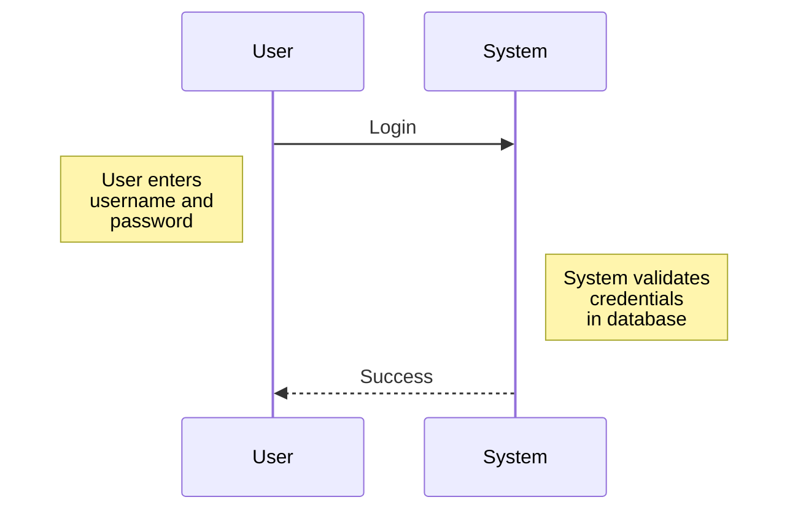
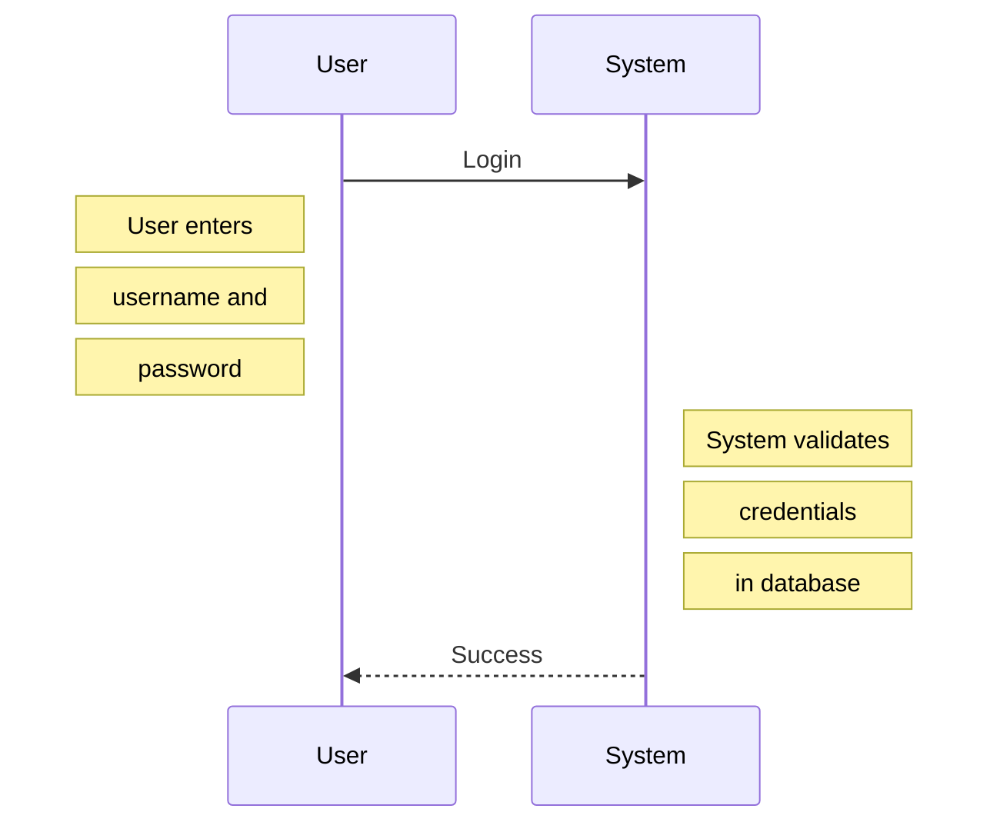
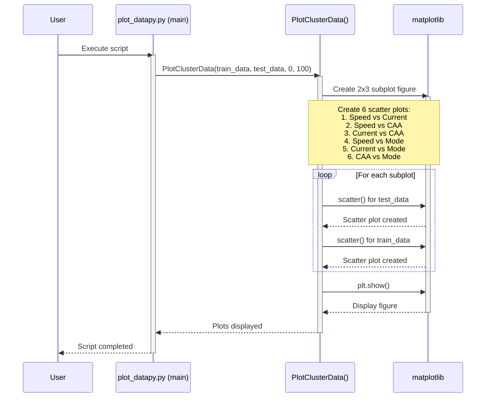
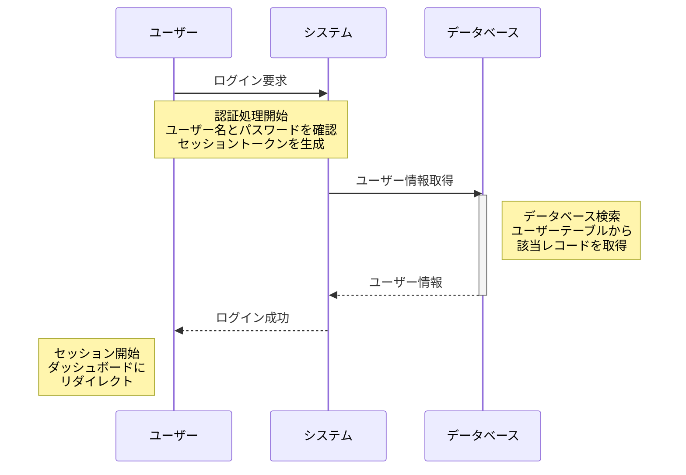

# シーケンス図テストコード

このファイルには、` `タグを含むシーケンス図のテストコードが含まれています。
エディタに貼り付けると、自動的に正しい形式に変換されます。

## テスト1: 基本的なNote with  

**自動変換後:**

## テスト2: Note left of / right of

**自動変換後:**

## テスト3: 複雑なシーケンス図（元のコード）

以下は、ユーザーが提供した元のコードです。このまま貼り付けても動作します：

## テスト4: 日本語コンテンツ

## 使い方

1. 上記のいずれかのコードブロックをコピー
2. Mermaidエディタに貼り付け
3. 「実行」ボタンをクリック
4. 自動的に` `タグが複数のNote行に分割されます
5. エディタのコードも自動更新されます

## 確認ポイント

- ✅ ` `タグが自動的に削除される
- ✅ 1つのNoteが複数のNote行に分割される
- ✅ Note over/left of/right of の位置が保持される
- ✅ エラーなく図が表示される
- ✅ SVG/PNG保存が正常に動作する
